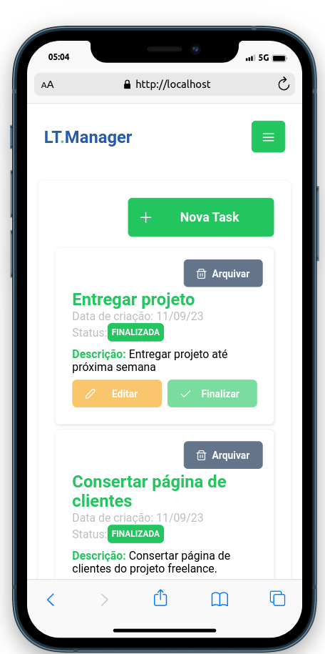
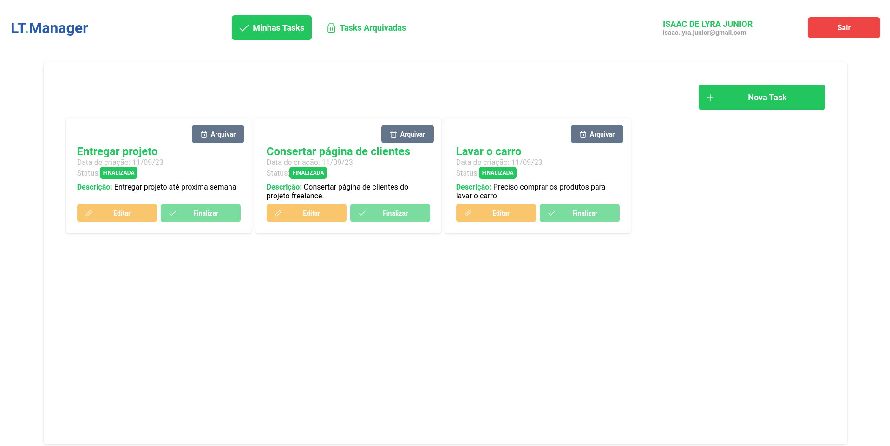

# LT.Manager

<!--  -->
O LT.Manager é um projeto full stack que combina o framework Angular para o frontend, o framework Spring Boot para o backend e o banco de dados PostgreSQL. O objetivo deste projeto é criar uma interface amigável onde você possa gerenciar tarefas, alterando seus estados.





## Stack do projeto
* Java 17
* Spring Boot 3.1
* TypeScript
* Angular 16.2
* PrimeNG 16.3
* PostgreSQL

## Funcionalidades e coisas a fazer

### Desenvolvidas
- [x] Registro de novos usuários
- [x] Autenticação e Autorização via JWT
- [x] Visualizar tasks cadastradas
- [x] Cadastrar nova task
- [x] Validação dos campos de cadastro de nova task
- [x] Atualizar task
- [x] Visualizar tasks arquivadas em página separada
- [x] Badge de status para as tasks
- [x] Hamburguer menu para dispositivos mobile
- [x] Responsividade para dispositivos mobile
- [x] Dockerfile do back e front e docker compose
- [x] Conseguir implementar reverse proxy com o Nginx

### A fazer
- [ ] Ordenação das tasks por data de criação
- [ ] Busca por título da task
- [ ] Documentação do back com Swagger ou SpringDoc
- [ ] Filtro de estado no front-end e agrupamento por status
- [ ] Paginação para melhorar performance da aplicação
- [ ] Testes unitários de todos os services do back-end (mínimo 60% de cobertura)
- [ ] Melhorar responsividade para dispositivos de tela mediana  (Tablets e afins)
- [ ] Melhorar segurança da aplicação
- [ ] Deploy na nuvem

## Pré-requisitos
* Docker

Como os arquivos Dockerfile já fazem o trabalho de compilar o código desenvolvido, basta ter o Docker instalado.

## Como executar

### Clone o repositório

```bash
git clone https://github.com/isaaclyra132/lt-manager.git
cd lt-manager
``````

### Execute o docker compose
> ATENÇÃO: O projeto está configurado para utilizar as portas 80, 8071 e 5432 da máquina, caso já esteja rodando alguma coisa nessas portas, certifique-se de deixá-las livres.
```bash
docker compose up --build
``````
## Uso
Após a inicialização dos conteiners, você pode acessar o aplicativo em http://lt-manager.localhost/. Certifique-se de ter o backend em execução antes de usar o aplicativo.

> Ao rodar pela primeira vez será necessário cadastrar uma nova conta na página de cadastro.

## Contribuindo
Se você deseja contribuir para este projeto, siga estas etapas:

- Faça um fork do repositório.
- Crie uma branch para sua contribuição: `git checkout -b minha-contribuicao`.
- Faça as alterações desejadas e faça commit delas: `git commit -m 'Minha contribuição'`.
- Faça push para a branch: `git push origin minha-contribuicao`.
- Abra um pull request para que suas alterações sejam revisadas.

## Licença
Este projeto está licenciado sob a Licença <a href="https://opensource.org/license/mit/" target="_blank">MIT</a>.

## Contato
Se você tiver alguma dúvida ou sugestão relacionada a este projeto, entre em contato:

Isaac de Lyra Junior - isaac.lyra.junior@gmail.com

https://github.com/isaaclyra132
